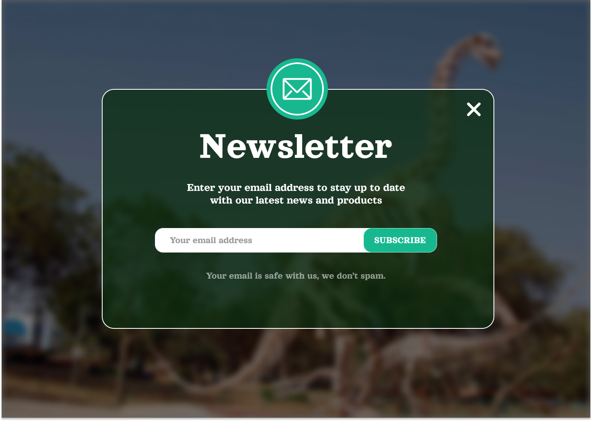

Hello, challenger !
 
Bienvenue à la deuxième journée du #30JoursDeCodeNe !
 
Aujourd'hui, nous vous lançons un nouveau défi : reproduire l'interface de la carte de mail.
Critères de validation :
 
Utilisez uniquement HTML et CSS pour recréer au mieux l'interface du défi.
Faites preuve de créativité dans le choix des couleurs, des polices et des espacements.
Postez votre réalisation sur vos réseaux sociaux avec le hashtag #30JoursDeCodeNe.
Soumettez la capture de votre travail dans le canal #soumettre-defi sur notre serveur Discord.
 
N'oubliez pas, vous avez 24 heures pour soumettre votre travail. 
 
Vous êtes sur la bonne voie, continuez à coder avec enthousiasme ! 
 
KeepCoding,
Sahel coders

