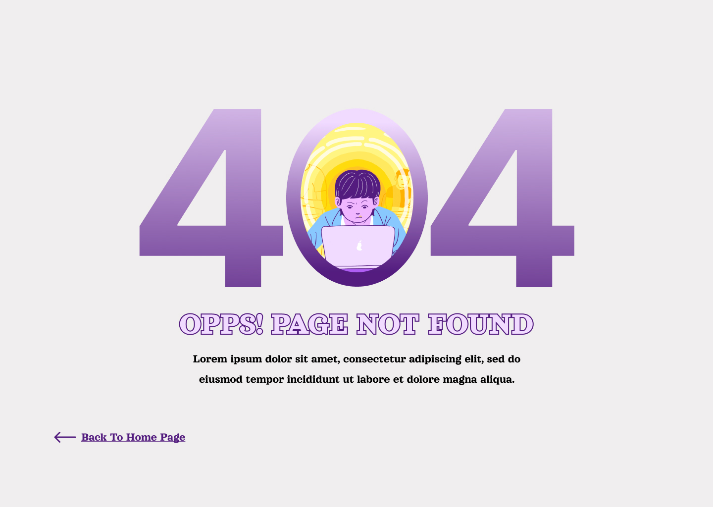

Bienvenue à la troisième journée du défi #30JoursDeCodeNe !

Aujourd'hui, notre défi consiste à reproduire une page d'erreur 404.

Critères de validation :

Utilisez uniquement HTML et CSS, mais si vous le souhaitez, vous pouvez ajouter de la dynamique à votre projet pour des raisons personnelles.
Faites preuve de créativité dans le choix des couleurs, des polices et des espacements.
Partagez votre réalisation sur vos réseaux sociaux en utilisant le hashtag #30JoursDeCodeNe.
Soumettez une capture de votre travail dans le canal #soumettre-defi sur notre serveur Discord.

Vous disposez de 24 heures pour soumettre votre travail.

Vous êtes sur la bonne voie, continuez à coder avec enthousiasme !

KeepCoding,
Sahel coders

