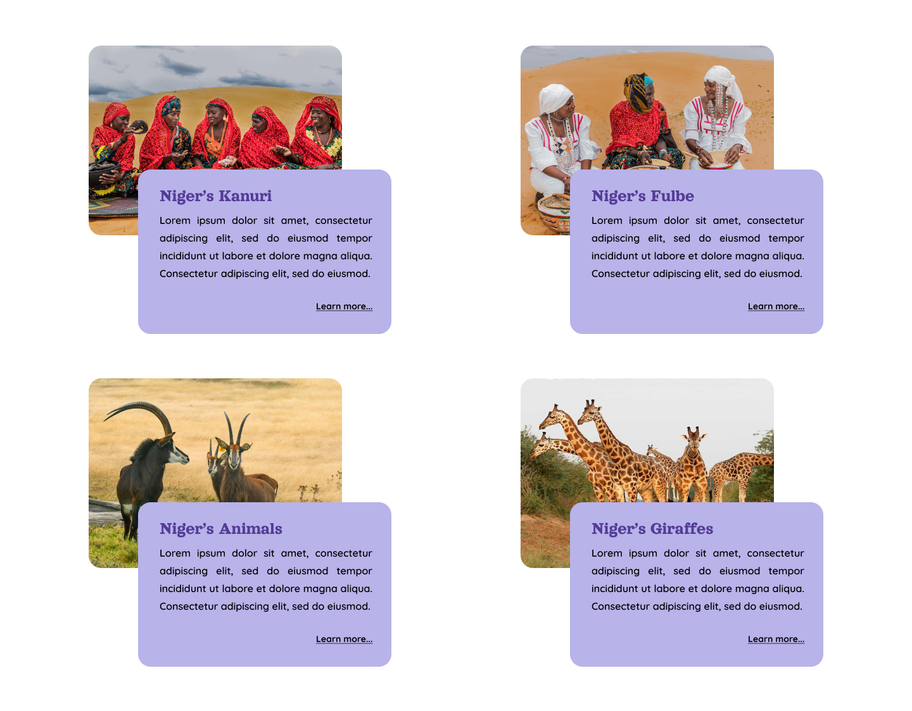

Hello @Challengers !

Bienvenue à la quatrième journée du défi, c'est parti !

Aujourd'hui, notre objectif est de reproduire cette page.

Critères de validation :

Utilisez uniquement HTML et CSS, mais n'hésitez pas à ajouter de la dynamique à votre projet pour des raisons personnelles.
Faites preuve de créativité dans le choix des couleurs, des polices et des espacements.
Partagez votre réalisation sur vos réseaux sociaux en utilisant le hashtag #30JoursDeCodeNe.
Soumettez une capture de votre travail dans le canal #soumettre-defi sur notre serveur Discord.

KeepCoding,

