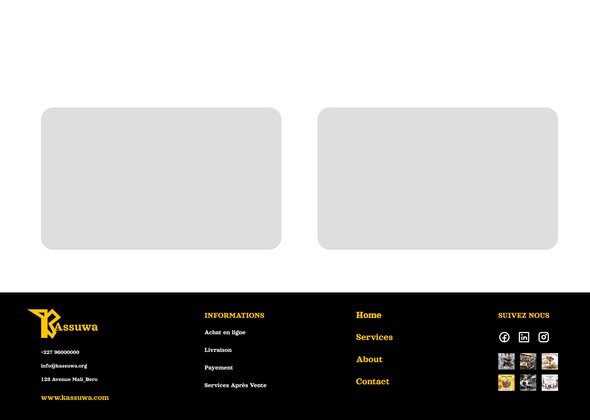

Hello @Challengers !

Bienvenue à la cinquième journée du défi, c'est parti !

Pour aujourd'hui, le défi consiste à recréer la mise en page de cette page web.

Critères de validation :

Utilisez exclusivement HTML et CSS, mais n'hésitez pas à ajouter une touche de dynamisme à votre projet pour des raisons personnelles.
Laissez libre cours à votre créativité dans le choix des couleurs, des polices et des espacements.
N'oubliez pas de partager votre réalisation sur vos réseaux sociaux en utilisant le hashtag #30JoursDeCodeNe.

KeepCoding,

