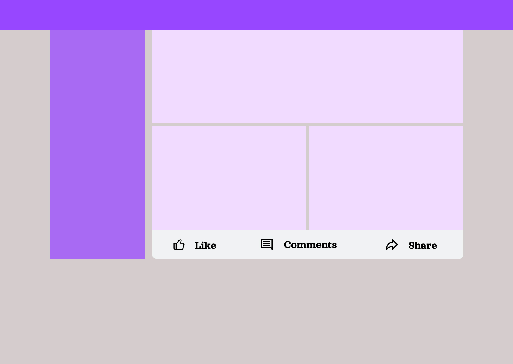

@everyone 

Jour 8

Pour la tâche du jour, le défi consiste à reproduire un **social media sharing buttons**

Utilisez exclusivement HTML et CSS, mais n'hésitez pas à ajouter une touche de dynamisme à votre projet pour des raisons personnelles. Laissez libre cours à votre créativité dans le choix des couleurs, des polices et des espacements. N'oubliez pas de partager votre réalisation sur vos réseaux sociaux en utilisant le hashtag #30JoursDeCodeNe. Pour soumettre votre travail, postez une capture d'écran dans le canal #soumettre-defi sur notre serveur Discord.

