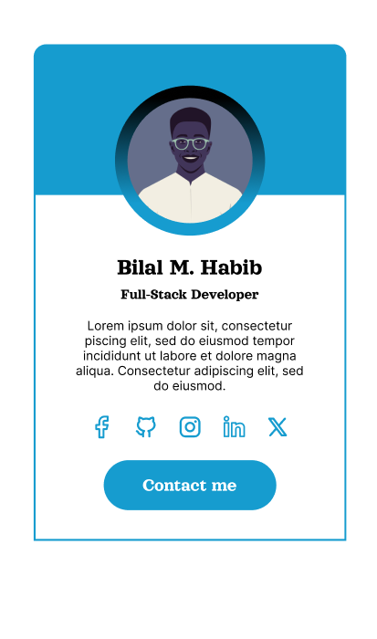

Hello everyone, 

Premier Défi : Reproduire l'Interface Profile card

Critères de Validation :

Utilisez uniquement HTML et CSS pour recréer au maximum l'interface du défi.
Soyez créatif(ve) dans le choix des couleurs, des polices, et des espacements.
Postez votre réalisation sur vos réseaux sociaux avec le hashtag #30JoursDeCodeNe.
Soumettez la capture de votre travail dans le canal #soumettre-defi sur notre serveur Discord.

encore assurez vous que vous :

Utilisez HTML et CSS pour reproduire l'interface de manière créative.
Partagez votre travail sur vos réseaux sociaux avec le hashtag #30JoursDeCodeNe.
Soumettez la capture de votre travail dans le canal #soumettre-defi sur Discord.
N'oubliez pas, chaque détail compte, alors faites preuve de créativité et montrez-nous votre flair pour le design !
Voici la première tâche à accomplir dans le cadre de ce défi, tant pour la version web que pour la version mobile.

Vous avez 24h pour soumettre votre travail.

Nous sommes impatients de voir votre première réalisation impressionnante ! Que l'aventure commence !

